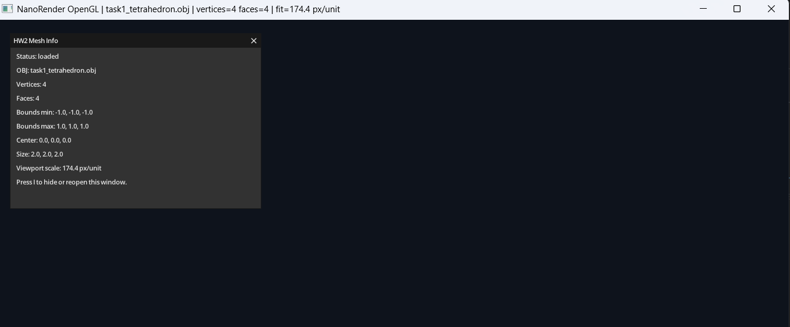
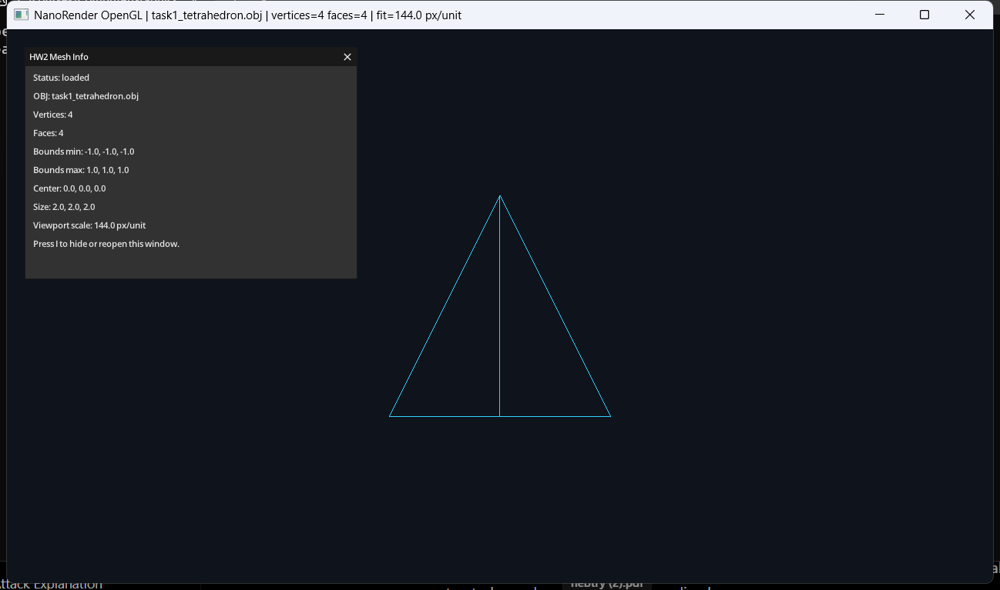
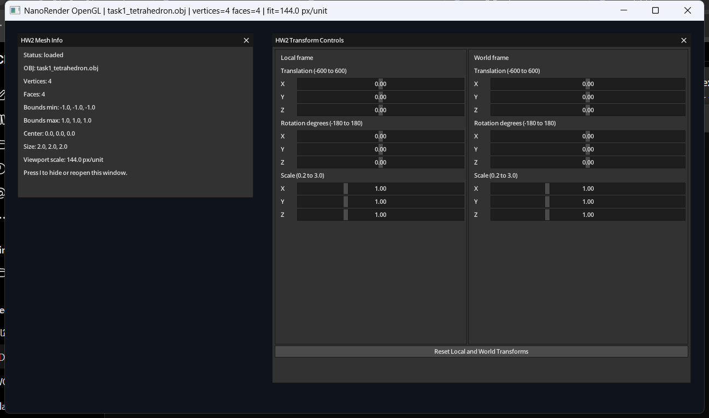
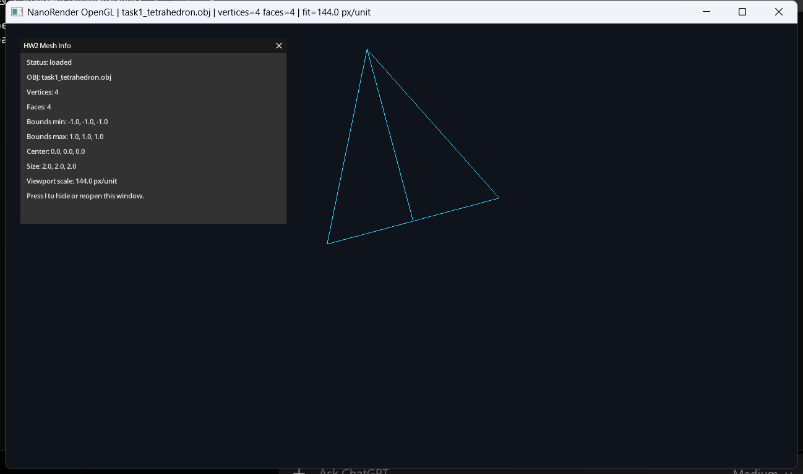
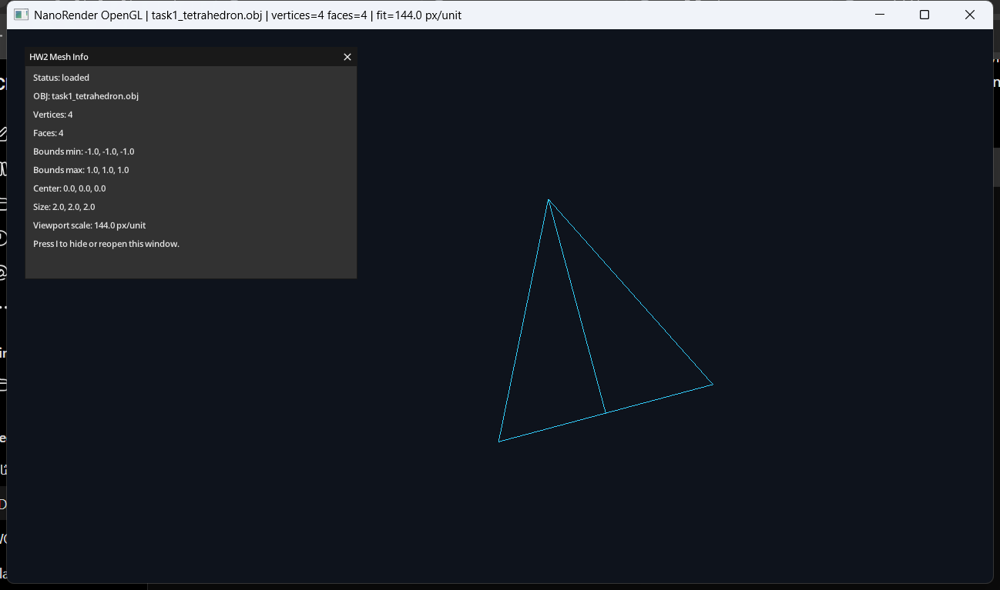
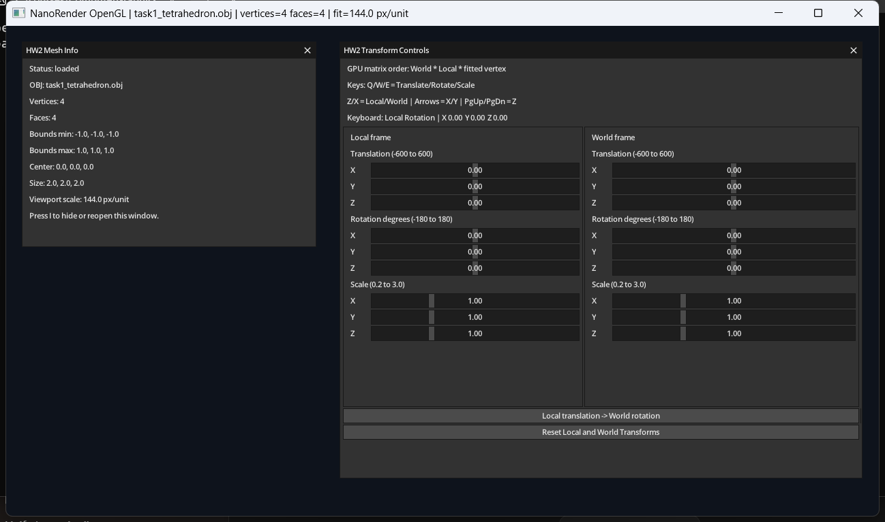
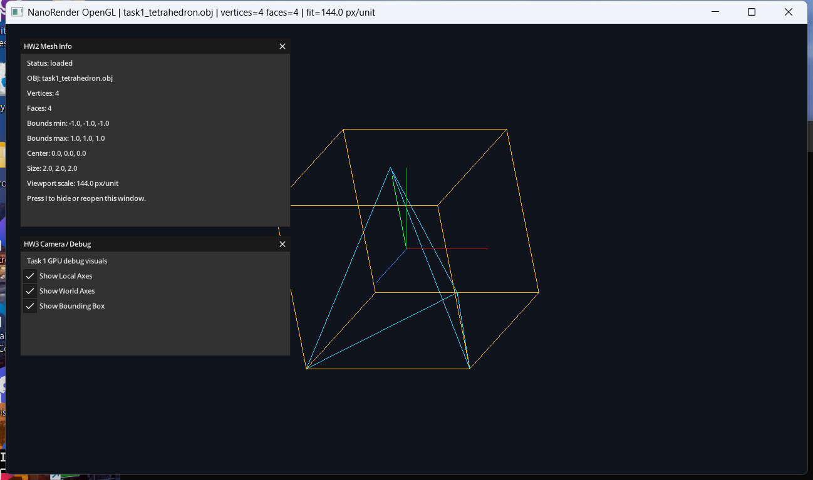
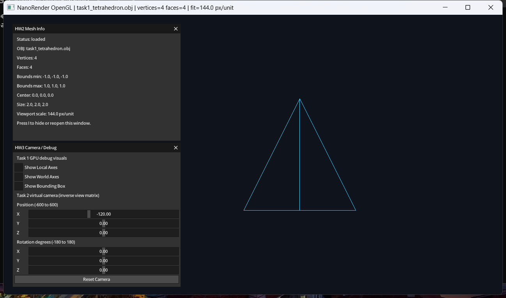

# NanoRender OpenGL

NanoRender OpenGL is a renderer developed incrementally to move a complete
graphics pipeline from CPU-side pixel processing to OpenGL and GLSL. Each
milestone keeps the application buildable, adds one focused GPU capability,
and records its validation and visual evidence here.

## Current Status

### OpenGL Foundation

The foundation creates an OpenGL 4.1 Core context with GLFW and GLAD and keeps a
resizable render loop. GLFW, GLM, and MicroUI are pinned through CMake.

```powershell
.\build\Release\nanorender_opengl.exe --validate foundation
```

Result: `Foundation validation passed.`

### HW2 Task 1 - Loading and Inspecting 3D Data

`src/mesh.cpp` loads OBJ positions and faces into GLM vertices and zero-based
triangle indices. The test tetrahedron has 4 vertices and 4 faces; the counts
are shown in a movable GPU-rendered MicroUI window. Polygon faces,
slash-separated face tokens, and negative indices are supported. Press `I` to
hide or reopen the window.

```powershell
.\build\Release\nanorender_opengl.exe --validate hw2-task1
```

Result: `vertices=4 faces=4 valid_indices=yes popup_rendered=yes`.



### HW2 Task 2 - Normalization and Viewport Fitting

The mesh bounds provide its center and largest dimension. One uniform scale
maps that dimension to 40% of the smaller framebuffer dimension, and a
translation centers it. The fit is recalculated after framebuffer resizing
and displayed in the same mesh-information window.

```powershell
.\build\Release\nanorender_opengl.exe --validate hw2-task2
```

Result at 1280 x 720: bounds `(-1,-1,-1)` to `(1,1,1)`, scale `144`,
translation `(640,360,0)`, and all fitted vertices inside the viewport.
Rendering begins in Task 3.

### HW2 Task 3 - Orthographic Wireframe Rendering

The mesh is uploaded once to a GPU vertex buffer. Each triangle contributes
three indexed edges to an element buffer, and `glDrawElements(GL_LINES, ...)`
draws the wireframe. The vertex shader applies the Task 2 viewport fit and an
orthographic projection before the fragment shader colors the edges.

```powershell
.\build\Release\nanorender_opengl.exe --validate hw2-task3
```

Result: 4 vertices, 4 faces, 24 line indices, and the validation framebuffer
contains the GPU-rendered wireframe.



### HW2 Task 4 - Local and World Transformation Controls

A persistent `TransformControls` state stores translation, rotation, and scale
on X, Y, and Z for both local and world space. A two-column GPU MicroUI window
exposes all 18 values plus a reset button. The values are displayed and edited
here but are not applied to the mesh until Task 5.

```powershell
.\build\Release\nanorender_opengl.exe --validate hw2-task4
```

Result: all 18 controls have valid defaults and the local/world panel is
present in the GPU-rendered framebuffer.



### HW2 Task 5 - Applying Transformations on the GPU

The UI values now build separate local and world matrices. The vertex shader
applies `projection * world * local * viewport-fit * vertex`, so transformations
happen on GPU before orthographic projection. Local rotation and scale use the
fitted model center as their pivot; world transforms use the global origin.

```powershell
.\build\Release\nanorender_opengl.exe --validate hw2-task5
```

Result: both required presets render on GPU and their detected wireframe
centers are separated, confirming that changing matrix order changes the image.

```powershell
.\build\Release\nanorender_opengl.exe --preset hw2-task5-local-world
.\build\Release\nanorender_opengl.exe --preset hw2-task5-world-local
```

Local translation followed by world rotation moves the translated offset around
the global origin:



Local rotation followed by world translation spins the mesh around its fitted
center and then moves it:



### HW2 Task 6 - Direct Keyboard Transformations

Keyboard input updates the same local/world values used by the sliders and GPU
matrices. `Q/W/E` select translation, rotation, or scale; `Z/X` select local or
world space. The arrow keys change X/Y, while `PageUp/PageDown` change Z.
Translation moves by `6`, rotation by `1.5` degrees, and scale by `0.02` per
frame; scale remains clamped to `0.2–3.0`.

```powershell
.\build\Release\nanorender_opengl.exe --validate hw2-task6
```

Result: translation and rotation steps pass, scale clamping passes, and a
keyboard translation moves the GPU wireframe by 6 pixels.



### HW3 Task 1 - Coordinate Frames and Bounding Boxes

A dynamic GPU line renderer draws colored local axes, fixed world axes, and the
12 edges of the mesh bounding box. Local axes and the box use the mesh model
matrices; world axes ignore model transforms. All three helpers have GPU MicroUI
checkboxes.

```powershell
.\build\Release\nanorender_opengl.exe --validate hw3-task1
.\build\Release\nanorender_opengl.exe --preset hw3-task1-debug
```

Result: 3 local axes, 3 world axes, 12 bounding-box edges, 18 total debug
lines, and 4 rendered faces.



### HW3 Task 2 - Virtual Camera and View Matrix

`CameraControls` stores world-space position and rotation. The camera transform
is inverted to produce the view matrix, which both GPU line shaders apply in
`Projection * View * Model * vertex` order. Position and rotation sliders share
the HW3 control window.

```powershell
.\build\Release\nanorender_opengl.exe --validate hw3-task2
.\build\Release\nanorender_opengl.exe --preset hw3-task2-camera
```

Result: moving the camera from X `0` to `-120` moves the wireframe center from
X `639.4` to `759.4`, confirming the inverse view transformation.



## Build and Run

Requirements:

- CMake 3.20 or newer
- A C++20 compiler
- Git
- A graphics driver supporting OpenGL 4.1 or newer

Configure and build:

```powershell
cmake -S . -B build
cmake --build build --config Release
```

Run on Windows:

```powershell
.\build\Release\nanorender_opengl.exe
```

## Roadmap

This roadmap follows the engine-related task order in the original HW2-HW5
project. A task is checked only after its implementation, validation,
documentation, focused commit, and push are complete.

### Foundation

- [x] Establish the OpenGL 4.1 Core foundation with GLFW and GLAD

### HW2 - Wireframe Viewer and Geometric Transformations

- [x] Task 0: Integrate GLM (included in the OpenGL foundation)
- [x] Task 1: Load OBJ data and display mesh information
- [x] Task 2: Calculate mesh bounds, normalization, and viewport fitting
- [x] Task 3: Render an indexed orthographic wireframe mesh
- [x] Task 4: Add separate local and world transformation controls
- [x] Task 5: Apply model transformations in the vertex shader
- [x] Task 6: Add direct keyboard or mouse transformation controls

### HW3 - Virtual Cameras and Projections

- [x] Task 1: Render GPU debug axes and object bounding boxes
- [x] Task 2: Add a virtual camera and view matrix
- [ ] Task 3: Add orthographic and perspective projection modes
- [ ] Task 4: Calculate, upload, transform, and visualize mesh normals

### HW4 - Triangle Rasterization and Depth Buffering

- [ ] Task 1: Add a GPU triangle bounding-box debug view
- [ ] Task 2: Add hardware triangle filling and visualize barycentric interpolation
- [ ] Task 3: Add GPU depth testing and depth-buffer visualization

### HW5 - Lighting, Materials, and Shading

- [ ] Task 1: Add light/material properties and ambient lighting
- [ ] Task 2: Add flat diffuse shading
- [ ] Task 3: Add specular lighting and reflection-vector debugging
- [ ] Task 4: Add per-fragment Phong shading

### Final Comparison

- [ ] Document the final CPU-to-GPU architecture, behavior, and performance comparison

Pair-programming extensions are outside this roadmap because they were not part
of the completed task reports used as the reference for this port.

## Project Structure

```text
nanorender-opengl/
|-- assets/         Direct visual evidence
|-- models/         Mesh files
|-- shaders/        GLSL shader programs
|-- src/            Renderer and application source
|-- third_party/    Generated GLAD loader
|-- CMakeLists.txt  Build and dependency configuration
`-- README.md       Documentation and progress log
```

## Development Workflow

Work is divided into small feature milestones. Every milestone must compile,
pass its validation mode, update this README, and receive a focused commit and
push before the next feature begins. Task notes stay brief and are appended in
implementation order from top to bottom. Visual milestones include a direct
screenshot or short GIF under `assets/`, whichever demonstrates the result more
clearly; animated evidence is kept below 3 MB.
